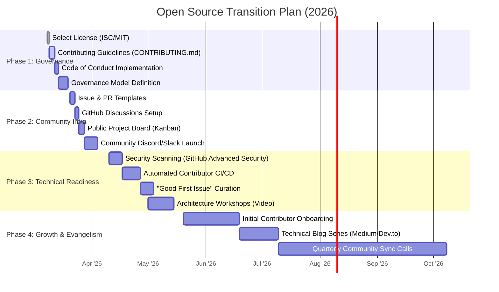

# 🌍 IoT Microservices: Open Source Strategy & Roadmap

This document outlines the strategic plan to transition the **IoT Microservices Project** into a thriving, community-driven open-source ecosystem. Our goal is to democratize high-performance IoT architecture and invite global collaboration.

---

## 📅 Open Source Implementation Roadmap

---

## 🛠️ Phases of the Strategic Transition

### 🛡️ Phase 1: Foundation & Governance (Est: 2 Weeks)
Establishing the legal and cultural framework to protect both the project and its participants.
- **Licensing**: Confirming the **ISC License** to ensure maximum freedom for users and contributors.
- **CONTRIBUTING.md**: Defining exactly how to submit code, documentation, and bug reports. Setting the "100% TDD Enforcement" standard as a contribution requirement.
- **Code of Conduct**: Adopting the *Contributor Covenant* to foster a welcoming, inclusive environment.

### 🏘️ Phase 2: Community Infrastructure (Est: 3 Weeks)
Building the communication channels where the "Heart" of the project will reside.
- **Developer Experience (DX)**: Implementing standardized templates for issues and pull requests to ensure high-quality submissions.
- **Live Communication**: Launching a dedicated community space (Discord or Slack) for real-time architectural debates and mentoring.
- **Transparency**: Moving the internal roadmap (like `Timeline.md`) to a public GitHub Project Board for real-time visibility.

### ⚙️ Phase 3: Technical Readiness (Est: 4 Weeks)
Ensuring the codebase is "Contributor Friendly" and secure.
- **CI/CD Hardening**: Implementing bots (e.g., Codecov, Dependabot) that provide immediate feedback to contributors.
- **Mentorship via Issues**: Labeling issues with `Good First Issue` and `Help Wanted` to lower the barrier to entry.
- **Documentation Overdrive**: Converting the *IoT Microservices Encyclopedia* into an interactive, searchable documentation site (using Docusaurus or GitBook).

### 🚀 Phase 4: Growth & Evangelism (Est: Ongoing)
Transitioning from a solo project to a global collective.
- **Ambassador Program**: Identifying core contributors to take on maintainer roles.
- **Showcase Projects**: Highlighting real-world implementations of the architecture in smart offices, farms, and industrial sites.
- **Educational Outreach**: Partnering with universities or coding bootcamps to use the project as a teaching tool for modern microservices.

---

## 📧 How to Get Involved NOW
If you're reading this, you are part of the early wave. We are currently looking for **Core Collaborators** in the following domains:
1.  **GKE & Cloud Infrastructure**
2.  **Machine Learning Operations (MLOps)**
3.  **Rust/Wasm Edge Development**
4.  **Community Management**

**Interested?** Send an email to **[sergioitremotejobs2025@gmail.com](mailto:sergioitremotejobs2025@gmail.com)** with the subject line `[CONTRIBUTE] - IoT Microservices`. 

---
*Maintained with ❤️ by Sergio Abad*
