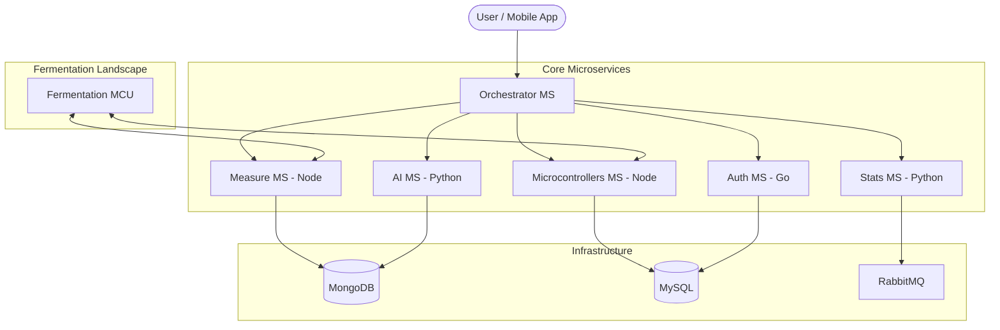

# 🌿 Fermented Food Microservices: Automation & Analytics

A robust, enterprise-grade ecosystem for remote monitoring and automation of fermented food processes. This project leverages a microservices architecture to provide real-time sensing, AI-driven forecasting, and secure device management.

## 🏗 System Architecture

## 🧫 The Automated Fermentation Process

This project is built specifically to handle the complex, biologically sensitive requirements of industrial and artisanal food fermentation. The automated process consists of four core pillars:

1. **Real-Time Biomarker Tracking**: Distributed ESP32 sensor nodes continuously ingest critical environmental variables such as **pH**, **CO2 concentration**, dissolved **O2**, **Temperature**, and **Humidity**.
2. **Predictive AI Modeling**: Rather than simply reacting to bad data, the `AI-MS` layer utilizes Long Short-Term Memory (LSTM) neural networks to forecast the trajectory of the fermentation curve. It predicts dangerous anomalies—like a sudden pH crash or an over-fermentation temperature spike—hours before they occur.
3. **Automated Actuation**: When thresholds are breached (or predicted to breach), the `Microcontrollers-MS` orchestrates physical interventions:
   - Engaging **cooling/heating loops** to stabilize culture temperatures.
   - Opening **pressure release valves** to vent excess CO2 buildup.
   - Triggering **agitation motors** to prevent culture stratification.
4. **Edge Resilience (Fog Computing)**: Because fermentation is a continuous biological process, the architecture guarantees survival during network partitions. Core control loops run locally at the edge, ensuring the culture is protected even if the cloud connection is lost.

## 🚀 Key Features

- **100% TDD Foundation**: Every core microservice is verified with 100% statement and branch coverage.
- **AI Forecasting**: LSTM-based modeling for predicting fermentation trends (pH, CO2, Humidity, Temperature).
- **Advanced Verification**:
  - **Mutation Testing**: Using Stryker and Mutmut to verify test quality.
  - **Contract Testing**: Pact CDC implementation for microservice compatibility.
  - **Fuzz Testing**: Input resilience testing for the API Gateway.
- **Secure by Design**: JWT-based authentication with internal API-key guarding for service-to-service communication.
- **Fully Containerized**: Kubernetes (GKE) ready with optimized Dockerfiles and Helm charts.

## 🧪 Testing State & CI/CD
This project is built with a **Test-Driven Development (TDD)** first approach and a "Zero-Tolerance" CI/CD policy.

- **Unit Tests**: `Jest` (Node), `Pytest` (Python), `Go internal` (Go).
- **Coverage Summary**: **100%** Across all 10+ services (See [CURRENT_COVERAGE.md](CURRENT_COVERAGE.md)).
- **Continuous Integration**: Powered by a unified **GitHub Actions Matrix**.
  - **Status**: ✅ **Stable & Green** on `main`.
  - **GHCR Integration**: Automated multi-architecture builds pushed to GitHub Container Registry (`ghcr.io`) on every push to `main`.
  - **Automated Releases**: Official versioned releases (`v*`) are automatically generated with attached architectural manifests and recovery scripts.
  - **Performance**: High-speed dependency caching (npm/go) for < 60s feedback loops.
- **Contract Verification**: Pact files are located in `orchestrator-ms/pacts/`.
- **Quality Metrics**: [Timeline.md](Timeline.md) tracks the progress towards 100% coverage and advanced quality.

## 🛠 Tech Stack

- **Backend**: Node.js (Express), Go, Python (Flask/TensorFlow).
- **Storage**: MongoDB, MySQL, Redis (Cache).
- **Communication**: REST API, RabbitMQ, WebSockets.
- **Frontend**: Angular 25+ with SCSS.
- **DevOps**: Docker, K8s, GitHub Actions, Terraform.

## 📜 Documentation

- [Project Roadmap & Timeline](Timeline.md)
- [TDD TODO List](TODO.md)
- [Open Source Strategy & Roadmap](Open_Source.md)
- [Architecture Details](../Fermented_Food.md)
- [GCP Infrastructure Costs](COSTS05032026.md)

## 🤝 Contributing & Open Source

This project is **100% Open Source** and under active development. We are always looking for passionate developers to join our mission of building the next generation of resilient IoT ecosystems.

Whether you're interested in:
- **Cloud Infrastructure** (GKE, Terraform)
- **Edge Computing** (WebAssembly, Rust)
- **Frontend** (Angular 25+)
- **Security** (mTLS, Zero-Trust Architecture)

We'd love to have you! If you're interested in contributing, feel free to **drop me an email** at [sergioitremotejobs2025@gmail.com](mailto:sergioitremotejobs2025@gmail.com). Let's build something amazing together!

---

## 👥 Top Contributors

| Contributor | Role | Contribution |
| :--- | :--- | :--- |
| **[Sergio Abad](https://github.com/sergioitremotejobs2025)** | **Lead Architect** | Visionary, Core developer, and Infrastructure lead. |
| **Roberto Gesteira Miñarro** | **Open Source Collaborator** | Strategic contributions and architectural guidance. |
| **[Antigravity (AI)](https://github.com/features/copilot)** | **AI Architect** | Pair-programming, TDD enforcement, and Documentation specialist. |

---

## 👨‍💻 About Me

Hi! I'm Sergio, a Software Engineer passionate about Cloud computing, Microservices, and IoT architectures. I love building scalable backend systems and exploring new technologies.

📫 **Contact me:**
- **Email:** sergioitremotejobs2025@gmail.com
- **LinkedIn:** [Sergio Abad](https://www.linkedin.com/in/sergio-abad/) *(Update with your actual link if different)*

🚀 **Open to opportunities!** I am currently looking for new roles and am open to job offers. Feel free to reach out to me!

---
*Maintained with ❤️ by Sergio*
