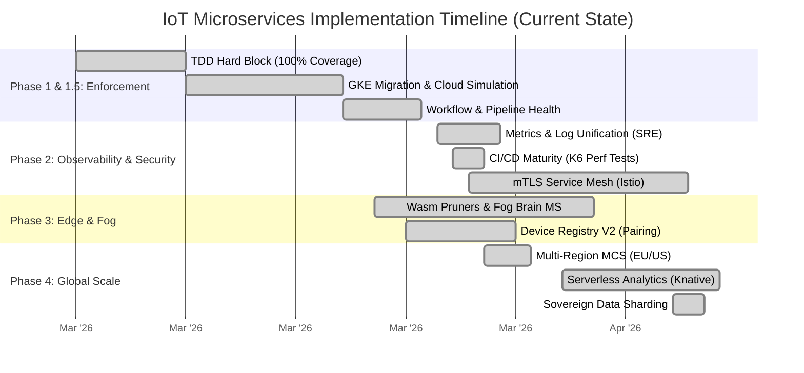

# ⏳ IoT Microservices: Strategic Execution Timeline

This document outlines the actual progress and estimated time/effort required for the remaining architectural expansions.

## 📊 High-Level Gantt Chart Roadmap

---

## 📅 Detailed Task Breakdown & Progress

### 🔵 Phase 1 & 1.5: Foundation & Pipeline (Completed)
Establishing the baseline for 100% test coverage and cloud registry reliability.

| Task | Status | Completion Date |
| :--- | :--- | :--- |
| **TDD Hard Block** | ✅ Done | 2026-03-07 |
| **GKE Autopilot Migration** | ✅ Done | 2026-03-15 |
| **Workflow Matrix Stabilization** | ✅ Done | 2026-03-22 |

### 🟢 Phase 2: Observability & Hardening (Completed)
Transitioning into professional SRE operations and zero-trust identity.

| Task | Effort | Status | Description |
| :--- | :--- | :--- | :--- |
| **Advanced Observability (SRE)**| **4 Days** | ✅ Done | Deployed Grafana, Loki (Logs), and Prometheus (Metrics) to GKE. |
| **Perf/Load Testing (K6)** | **2 Days** | ✅ Done | Integrated K6 automated performance regressions into CI pipeline. |
| **mTLS Service Mesh Pilot** | **2 Weeks**| ✅ Done | Deployed Cloud Service Mesh across EU/US Fleet. STRICT mTLS enforced. |
| **Security Audit & Hardening** | **1 Week** | ✅ Done | 2026-04-10: Fleet-wide hardening (Non-root, Read-only FS). Passed `gke-cis-audit`. |

### ✅ Phase 3: Edge & Fog Intelligence (Completed)
Successfully decentralized compute and implemented local survival logic.

| Task | Effort | Status | Description |
| :--- | :--- | :--- | :--- |
| **Wasm Ingestion Prototypes** | **2 Weeks** | ✅ Done | Deployed Go-based `pruner.wasm` edge data pruners. |
| **Fog Node Integration** | **2 Weeks** | ✅ Done | Implemented `fog-brain-ms` with SQLite local persistence. |
| **Device Registry V2** | **1 Week**  | ✅ Done | Upgraded pairing protocols and discovery logic. |

### 🔴 Phase 4: Global Mesh & Infinite Scale (Completed)
Achieving global active-active federation and serverless cost-efficiency.

| Task | Estimated | Status | Description |
| :--- | :--- | :--- | :--- |
| **Multi-Region MCS (EU/US)** | **3 Days** | ✅ Done | Federated EU-west1 and US-central1 clusters via GKE Fleet. Enabled MCS for global discovery. |
| **Serverless Burst (Knative)** | **3 Weeks** | ✅ Done | Scale-to-zero active for `stats-ms` and `ai-ms`. Verified via analytical load injection. |
| **Sovereign Sharding** | **4 Weeks** | ✅ Done | Implemented Jurisdiction-aware routing via MongoDB Zone Sharding. Verified GDPR/CCPA compliance. |

## ❄️ Hibernation & Zero-Cost State
*Status: **ACTIVE** — April 10, 2026*
All GCP infrastructure (GKE, Disks, IPs, Registry) has been deprovisioned to reach a **verified $0.00 base cost**. The environment can be restored using `./recreate_all_gcp.sh`.

---
*Updated Technical Audit: April 10, 2026*
